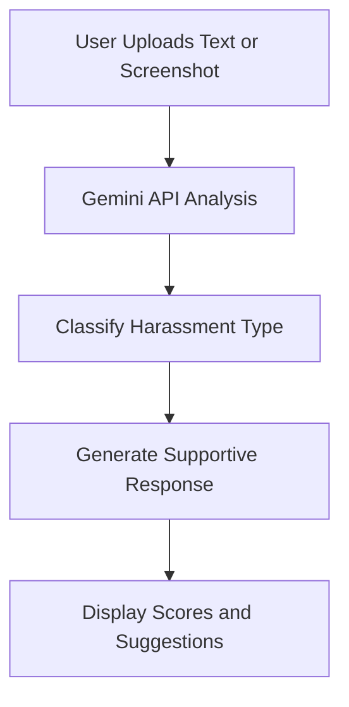
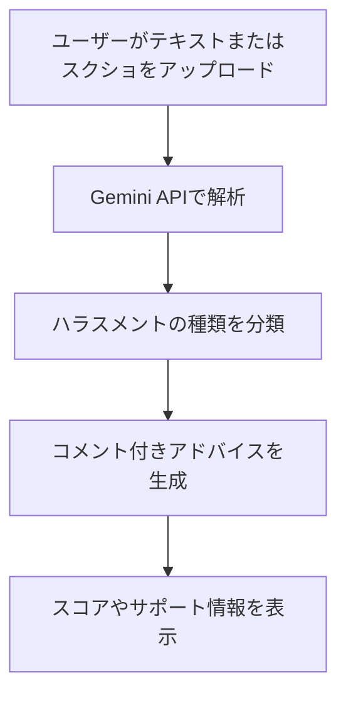

# 🚨 Harassment AI Judgment – Web Platform

An AI-powered harassment classification tool built with Gemini API & multi-modal input support.  
Designed for users in Japan seeking safe, anonymous, and expert-informed AI support.

🌐 **Live Demo**: [aiharajudge.site](https://aiharajudge.site/)  
🧠 **Backend**: [aiharajudge-gemini-api-key-proxy](https://github.com/changch223/aiharajudge-gemini-api-key-proxy)

---

## 💡 What is Harassment AI Judgment?

Not sure if your experience counts as harassment?  
👉 Try our free AI-powered judgment tool (Japanese only)

> This website leverages advanced multi-modal AI to detect and classify harassment types based on conversation screenshots or text input.

---

## ✨ Service Features

- ⚖️ **Instant Harassment Classification**  
  Classifies types like **power harassment**, **moral harassment**, and **sexual harassment** using Japan’s Ministry of Health, Labour and Welfare guidelines.

- 🕊 **Confidential and Anonymous**  
  No sign-up required. Everything is processed client-side or via a secure Gemini API proxy.

- 📊 **Clear Visual Feedback**  
  Users receive a breakdown of possible harassment types (s), severity score, and supportive next-step suggestions.

---

## 🔧 Tech Stack

- 🔍 Frontend: HTML + JS (Static hosting via ConoHa Wing)
- 🤖 AI Model: Google Gemini 1.5 Pro
- ☁️ Backend: FastAPI proxy to Gemini ([repo](https://github.com/changch223/aiharajudge-gemini-api-key-proxy)) deployed to Google Cloud Run
- 🔐 Secure Gemini Key Proxy with CORS and JSON schema response control

---

## 🧪 Workflow

  

## 🖼 Screenshots & Demo

  
   
  

---

## 🧠 How It Works

1. Users upload a conversation screenshot or enter message text.  
2. The system sends content to Gemini API for real-time analysis.  
3. AI classifies the message into structured harassment types.  
4. Output includes explanation, suggestions, and helpful resources.

---

## 🌍 Languages

- 🈚 Current: Japanese-only  
- 🌐 In Progress: English, Traditional Chinese

---

## 📄 License

MIT License

---

# 🚨 Harassment AI Judgment – ハラスメントAI判定サイト

AIを活用して会話のスクリーンショットやテキストからハラスメントの可能性を分類・可視化する、匿名・無料のWebサービスです。

🌐 **公開中サイト**: [aiharajudge.site](https://aiharajudge.site/)  
🧠 **バックエンド**: [aiharajudge-gemini-api-key-proxy](https://github.com/changch223/aiharajudge-gemini-api-key-proxy)

---

## 💡 Harassment AI Judgment とは？

自分の体験がハラスメントに該当するかどうか分からない？  
👉 無料のAI判定ツール（現在は日本語のみ対応）を試してみてください。

> 会話のスクショや文章をアップロードするだけで、厚生労働省の基準に基づき、AIがハラスメントの種類を自動分類・判定します。

---

## ✨ 主な特徴

- ⚖️ **即時ハラスメント分類**  
  パワハラ・モラハラ・セクハラなど、厚生労働省のガイドラインに沿った9分類に自動マッピング。

- 🕊 **匿名・非ログインで安心利用**  
  ユーザー情報を取得せず、入力データはAI処理後に自動削除。

- 📊 **視覚的でわかりやすい結果表示**  
  判定された種類、深刻度スコア、アドバイスが表示され、今後の行動に役立ちます。

---

## 🔧 技術構成

- フロントエンド：HTML + JS（ConoHa Wing でホスティング）  
- AIモデル：Google Gemini 1.5 Pro  
- バックエンド：FastAPI + Gemini API Proxy（[リポジトリ](https://github.com/changch223/aiharajudge-gemini-api-key-proxy)）  
- セキュリティ：CORS + Schema付き構造化レスポンス

---

## 🧪 ワークフロー

## 🖼 デモ・画面サンプル

  

## 🖼 Screenshots & Demo

  
   
  

---

## 🧠 使い方の流れ

1. 会話のスクショ、またはテキストを入力  
2. Gemini APIでリアルタイム解析  
3. ハラスメント種類を構造化して分類  
4. 判定結果・アドバイス・スコアを表示

---

## 🌍 言語対応

- 🈚 現在：日本語のみ対応  
- 🌐 今後：英語・繁體中文に対応予定

---

## 📄 ライセンス

MIT License

---

## 🙋‍♂️ 開発者

Created by **Chia-Wei Chang**  
フィードバックや改善提案は歓迎します！  
Fork、Issue どちらでもお気軽にご連絡ください。
