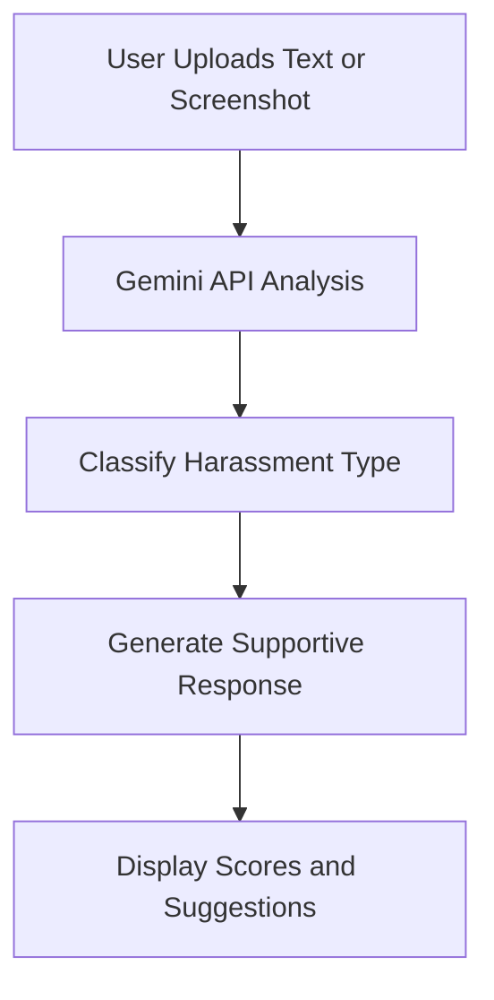
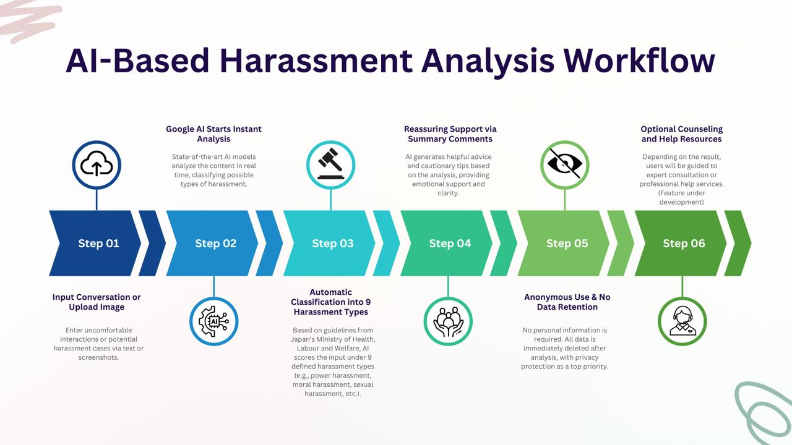

# 🚨 Harassment AI Judgment – Web Platform

An AI-powered harassment classification tool built with Gemini API & multi-modal input support.  
Designed for users in Japan seeking safe, anonymous, and expert-informed AI support.

🌐 **Live Demo**: [aiharajudge.site](https://aiharajudge.site/)  
🧠 **Backend**: [aiharajudge-gemini-api-key-proxy](https://github.com/changch223/aiharajudge-gemini-api-key-proxy)

---

## 💡 What is Harassment AI Judgment?

Not sure if your experience counts as harassment?  
👉 Try our free AI-powered judgment tool (Japanese only)

> This website leverages advanced multi-modal AI to detect and classify harassment types based on conversation screenshots or text input.

---

## ✨ Service Features

- ⚖️ **Instant Harassment Classification**  
  Classifies types like **power harassment**, **moral harassment**, and **sexual harassment** using Japan’s Ministry of Health, Labour and Welfare guidelines.

- 🕊 **Confidential and Anonymous**  
  No sign-up required. Everything is processed client-side or via a secure Gemini API proxy.

- 📊 **Clear Visual Feedback**  
  Users receive a breakdown of possible harassment types (s), severity score, and supportive next-step suggestions.

---

## 🔧 Tech Stack

- 🔍 Frontend: HTML + JS (Static hosting via ConoHa Wing)
- 🤖 AI Model: Google Gemini 1.5 Pro
- ☁️ Backend: FastAPI proxy to Gemini ([repo](https://github.com/changch223/aiharajudge-gemini-api-key-proxy)) deployed to Google Cloud Run
- 🔐 Secure Gemini Key Proxy with CORS and JSON schema response control

---

## 🧪 Workflow

## 🖼 Screenshots & Demo

  
   
  
   
  

---

## 🧠 How It Works

1. Users upload a conversation screenshot or enter message text.  
2. The system sends content to Gemini API for real-time analysis.  
3. AI classifies the message into structured harassment types.  
4. Output includes explanation, suggestions, and helpful resources.

---

## 🌍 Languages

- 🈚 Current: Japanese-only  
- 🌐 In Progress: English, Traditional Chinese

---

## 📄 License

MIT License

---

## 🙋 Author

Created by **[Chia-Wei Chang](https://github.com/changch223)**  
Feedback and collaboration are welcome!  
Feel free to fork or raise issues.
